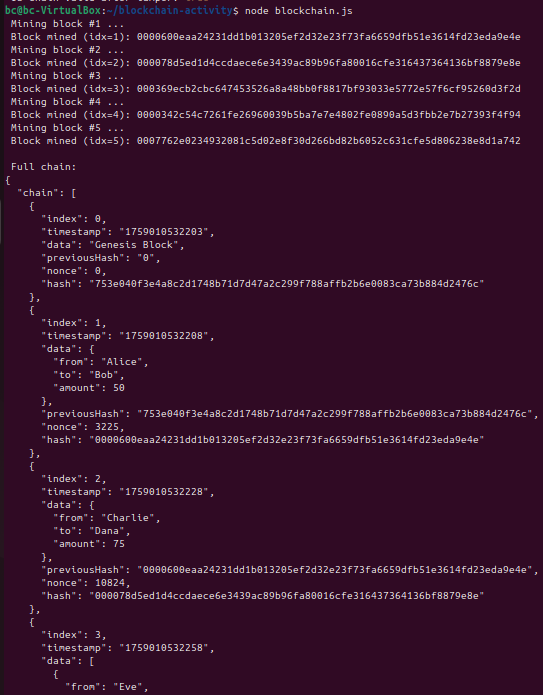

### How to run the code
- cd to the folder with blockchain.js, then use "node blockchain.js"

### Screenshots

- Explanation: The .js script is ran, and the blockchain transactions processed as planned. The pre-written temper code tempered with transaction 1, changing the amount to 101, which turned the previously valid transaction chain to be detected as invalid.

### Short Reflection
- Hashing is created based on the content of the transaction and any modification to it creates a different hash, which breaks the link between blocks and therefore fail the validation check. This is what makes the chain immutable as any changes to the content will change the hash. 

- Proof-of-Work requires extensive computation to find a valid hash, for any users. An attacker would also need to do this work each time per target, which is very time consuming to do. This is only true for pre-quantum computers.

- I was surprised that blockchain could be simulated on a single computer without a local server running. Though I do understand this is not a full implementation of blockchain and only replicates the hashes and hash validation, which can be done within non-blockchain environment.
